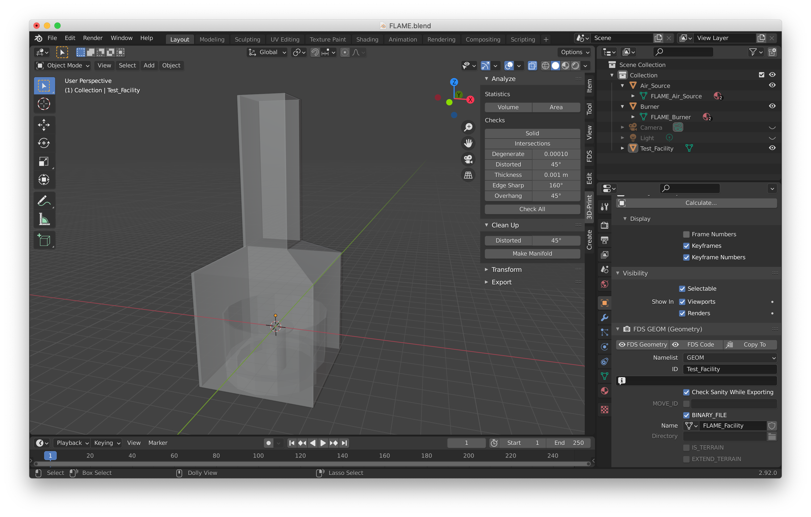

### References

Flame_first.dwg was obtained from Sandia National Laboratories.

The facility is described in this paper:  
S. R. TIESZEN and T. J. O’HERN, R. W. SCHEFER, E. J. WECKMAN, T. K. BLANCHAT. Experimental Study of the Flow Field In and Around A One Meter Diameter Methane Fire. _COMBUSTION AND FLAME_ 129:378–391 (2002).

### Pyrosim

Sandia_FLAME.psm is a [Pyrosim](https://www.thunderheadeng.com/pyrosim/) input file obtained by importing the Flame_first.dwg file.

### BlenderFDS

FLAME.blend is a [BlenderFDS](https://github.com/firetools/blenderfds) file built based on the description in the paper cited above.

